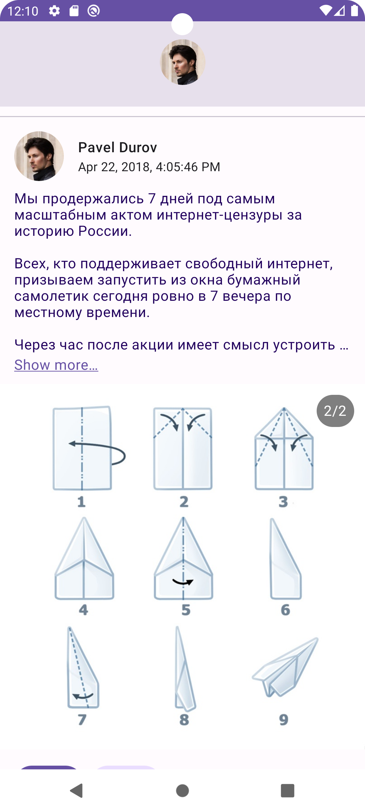

# Sample VK App

Маленький клиент ВК.

Написано на Kotlin, с использованием Jetpack Compose и VK Android SDK.
Везде используется Material3 в светлой теме.

## Функционал

- Авторизация через VK SDK
- Просмотр стены пользователя (пока id = 1, то есть стена Павла Дурова)
    - Подгрузка фото пользователя
    - Числа на счетчиках лайков и т.д. сокращаются в K/M/B (4523 -> 4,5К)
    - Длинные посты обрезаются под кнопку "Show more"
    - (пока что) Просмотр только фотографий
- Ставить/убирать лайки
    - Мгновенный фидбек в виде изменения цвета кнопки
- Карусель фотографий
    - Соотношение сторон от 1:1 до 2:1, остальное вмещается в центр
- Анимации сжатия шапки при скролле, изменения цветов кнопок

## Скриншоты

### Шапка профиля

### Пост с картинкой

### Пост с двумя картинками

### Пост с раскрытым Show more

